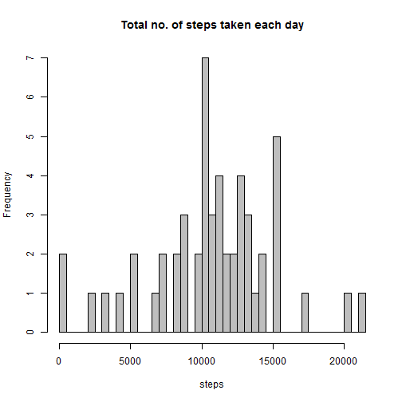
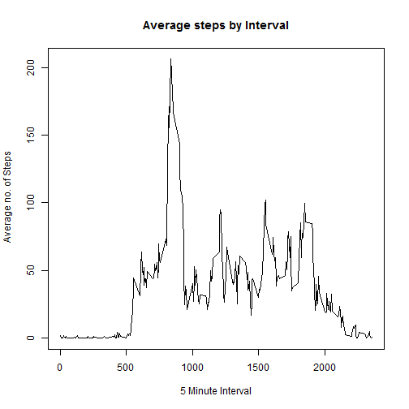
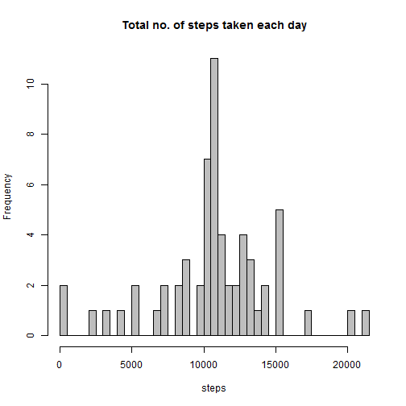

This is an R Markdown document. Markdown is a simple formatting syntax for authoring HTML, PDF, and MS Word documents. For more details on using R Markdown see <http://rmarkdown.rstudio.com>.

When you click the **Knit** button a document will be generated that includes both content as well as the output of any embedded R code chunks within the document. You can embed an R code chunk like this:


```r
library(lattice)
library(knitr)
```

#Loading and preprocessing the data

###Show any code that is needed to load the data (i.e. read.csv())

```r
activity<-read.csv("activity.csv")
```
#Process/transform the data (if necessary) into a format suitable for your analysis

```r
str(activity)
```

```
## 'data.frame':	17568 obs. of  3 variables:
##  $ steps   : int  NA NA NA NA NA NA NA NA NA NA ...
##  $ date    : Factor w/ 61 levels "2012-10-01","2012-10-02",..: 1 1 1 1 1 1 1 1 1 1 ...
##  $ interval: int  0 5 10 15 20 25 30 35 40 45 ...
```

```r
activity$date <- as.Date(activity$date, format = "%Y-%m-%d")
```

#What is mean total number of steps taken per day?

```r
activity_steps_mean_by_date<-aggregate(steps~date,data = activity,mean,na.rm=TRUE)
head(activity_steps_mean_by_date)
```

```
##         date    steps
## 1 2012-10-02  0.43750
## 2 2012-10-03 39.41667
## 3 2012-10-04 42.06944
## 4 2012-10-05 46.15972
## 5 2012-10-06 53.54167
## 6 2012-10-07 38.24653
```

#For this part of the assignment, you can ignore the missing values in the dataset.

### 1. Calculate the total number of steps taken per day

```r
activity_steps_sum_by_date <- aggregate(steps~date,data = activity,sum,na.rm=TRUE)
head(activity_steps_sum_by_date)
```

```
##         date steps
## 1 2012-10-02   126
## 2 2012-10-03 11352
## 3 2012-10-04 12116
## 4 2012-10-05 13294
## 5 2012-10-06 15420
## 6 2012-10-07 11015
```

### 2. If you do not understand the difference between a histogram and a barplot, research the difference 
###    between them. Make a histogram of the total number of steps taken each day

```r
hist(activity_steps_sum_by_date$steps,breaks = 50, col = "grey", border = "black", main = "Total no. of steps taken each day", xlab = "steps", ylab = "Frequency")
```

 

### 3. Calculate and report the mean and median of the total number of steps taken per day

```r
mean_steps<-mean(activity_steps_sum_by_date$steps)
median_steps<-median(activity_steps_sum_by_date$steps)
mean_steps
```

```
## [1] 10766.19
```

```r
median_steps
```

```
## [1] 10765
```

# What is the average daily activity pattern?

### 1. Make a time series plot (i.e. type = "l") of the 5-minute interval (x-axis) and the average number of steps 
###    taken, averaged across all days (y-axis)

```r
activity_steps_mean_by_interval <- aggregate(steps~interval,data = activity,mean,na.rm=TRUE)
head(activity_steps_mean_by_interval)
```

```
##   interval     steps
## 1        0 1.7169811
## 2        5 0.3396226
## 3       10 0.1320755
## 4       15 0.1509434
## 5       20 0.0754717
## 6       25 2.0943396
```

```r
plot(activity_steps_mean_by_interval$interval,activity_steps_mean_by_interval$steps,type = "l",main = "Average steps by Interval", xlab = "5 Minute Interval",ylab = " Average no. of Steps", col = "black")
```

 

### 2. Which 5-minute interval, on average across all the days in the dataset, contains the maximum number of steps?

```r
activity_steps_mean_by_interval[which.max(activity_steps_mean_by_interval$steps),1]
```

```
## [1] 835
```


# Imputing missing values

## Note that there are a number of days/intervals where there are missing values (coded as NA).
## The presence of missing days may introduce bias into some calculations or summaries of the data.

### 1. Calculate and report the total number of missing values in the dataset (i.e. the total number of rows with NAs)

```r
count_of_na <- sum(is.na(activity$steps))
count_of_na
```

```
## [1] 2304
```

### 2. Devise a strategy for filling in all of the missing values in the dataset. The strategy does not need 
###    to be sophisticated. For example, you could use the mean/median for that day, or the mean for that 5-minute interval, etc.

### stregaty : mean of 5 minute interval is used

```r
new_activity<-activity

for ( i in 1:nrow(activity_steps_mean_by_interval))
{
  new_activity[i,1] <- new_activity$steps[new_activity$interval==activity_steps_mean_by_interval[i,1] & is.na(new_activity$steps)]<- activity_steps_mean_by_interval[i,2]
  
}
```


### 3. Create a new dataset that is equal to the original dataset but with the missing data filled in new dataset done above

```r
head(new_activity)
```

```
##       steps       date interval
## 1 1.7169811 2012-10-01        0
## 2 0.3396226 2012-10-01        5
## 3 0.1320755 2012-10-01       10
## 4 0.1509434 2012-10-01       15
## 5 0.0754717 2012-10-01       20
## 6 2.0943396 2012-10-01       25
```

```r
sum(is.na(new_activity$steps))
```

```
## [1] 0
```

### 4. Make a histogram of the total number of steps taken each day and Calculate and report the mean and
###    median total number of steps taken per day. Do these values differ from the estimates from the first part of
###    the assignment? What is the impact of imputing missing data on the estimates of the total daily number of steps?


```r
new_activity_steps_sum_by_date <- aggregate(steps~date,data = new_activity,sum,na.rm=TRUE)

hist(new_activity_steps_sum_by_date$steps,breaks = 50, col = "grey", border = "black", main = "Total no. of steps taken each day", xlab = "steps", ylab = "Frequency")
```

 

```r
activity_steps_sum_by_date<-aggregate(steps~date,data = activity,sum,na.rm=TRUE)
new_activity_steps_sum_by_date<-aggregate(steps~date,data = new_activity,sum,na.rm=TRUE)

mean(activity_steps_sum_by_date$steps)
```

```
## [1] 10766.19
```

```r
median(activity_steps_sum_by_date$steps)
```

```
## [1] 10765
```

```r
mean(new_activity_steps_sum_by_date$steps)
```

```
## [1] 10766.19
```

```r
median(new_activity_steps_sum_by_date$steps)
```

```
## [1] 10766.19
```
### Result : Mean has remained same but median has increased


# Are there differences in activity patterns between weekdays and weekends?

## For this part the weekdays() function may be of some help here. Use the dataset with the filled-in missing values for this part.

### 1. Create a new factor variable in the dataset with two levels – “weekday” and “weekend” indicating whether a given 
###    date is a weekday or weekend day.

```r
new_activity$daytype<-weekdays(new_activity$date) 
new_activity$weekend_flag<-""
new_activity[new_activity$daytype=="Saturday" | new_activity$daytype=="Sunday",]$weekend_flag<-"weekend"
new_activity[!(new_activity$daytype=="Saturday" | new_activity$daytype=="Sunday"),]$weekend_flag<-"weekday"
head(new_activity)
```

```
##       steps       date interval daytype weekend_flag
## 1 1.7169811 2012-10-01        0  Monday      weekday
## 2 0.3396226 2012-10-01        5  Monday      weekday
## 3 0.1320755 2012-10-01       10  Monday      weekday
## 4 0.1509434 2012-10-01       15  Monday      weekday
## 5 0.0754717 2012-10-01       20  Monday      weekday
## 6 2.0943396 2012-10-01       25  Monday      weekday
```

### 2. Make a panel plot containing a time series plot (i.e. type = "l") of the 5-minute interval (x-axis) and the average
###    number of steps taken, averaged across all weekday days or weekend days (y-axis). See the README file in the GitHub
###   repository to see an example of what this plot should look like using simulated data.

```r
new_activity_steps_mean_by_interval_weekendflag <- aggregate(steps~interval+weekend_flag,data = new_activity,mean)

xyplot(steps~interval|weekend_flag,data=new_activity_steps_mean_by_interval_weekendflag,type="l",layout=c(1,2),xlab = "Interval",ylab = "Number of steps", Main="Average no. of steps taken by Interval and Day type")
```

 


